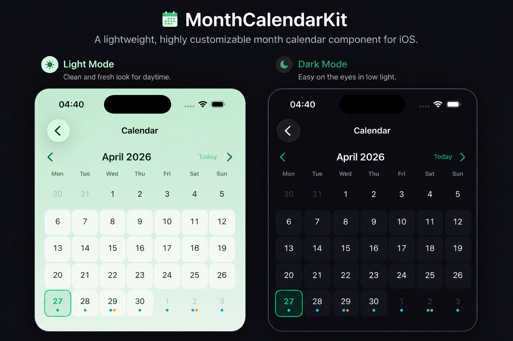

# MonthCalendarKit



[](https://github.com/rouzbeh-abadi/MonthCalendarKit/actions/workflows/test.yml)
[](LICENSE)
[](https://swift.org)
[](Package.swift)

A small, theme-able monthly calendar grid for SwiftUI.

`MonthCalendarKit` gives you a paged month view with custom-built
day cells: any per-day decoration (status dots, badges, photos,
custom shapes) is rendered by your own view builder while the
package handles the date math, the navigation chrome and the
selection state.

## What's inside

- **`MonthCalendarView<DayContent>`**: the public, generic
  calendar view. Pass bindings for the displayed month and the
  selected day plus a builder for each cell.
- **`CalendarDay`**: the descriptor passed into your day-cell
  builder. Carries the date plus `isCurrentMonth`, `isToday` and
  `isSelected` flags.
- **`PlainDayCell`**: minimal built-in cell that just shows
  the day number with the today border and selected fill.
- **`DotIndicatorDayCell`**: built-in cell that shows the
  day number plus up to three small status dots underneath.
- **`MonthCalendarTheme`**: protocol for injecting your
  brand colors via `@Environment`. Defaults to system colors via
  `DefaultMonthCalendarTheme`.

What it deliberately is not:

- Not a wrapper around UIKit's `UICalendarView`. The whole grid is
  pure SwiftUI primitives (`LazyVGrid`, `Button`, `Text`, `Circle`)
  so it themes cleanly with your own design tokens.
- Not a date picker. Selection is a free-form `Date?`; what to
  do with it is up to the host.
- Not opinionated about content. The day-cell view is generic, so
  you can render whatever you like in each cell.

## Requirements

- iOS 17, macOS 14, visionOS 1
- Swift 6, Xcode 16+

## Installation

```swift
.package(url: "https://github.com/rouzbeh-abadi/MonthCalendarKit.git", from: "1.0.0")
```

Or, while developing inside a monorepo, reference the package by path:

```swift
.package(path: "Packages/MonthCalendarKit")
```

## Quick start

```swift
import SwiftUI
import MonthCalendarKit

struct ContentView: View {
    @State private var month = Date()
    @State private var selection: Date? = Date()

    var body: some View {
        ScrollView {
            MonthCalendarView(month: $month, selection: $selection) { day in
                PlainDayCell(day: day)
            }
            .padding(.horizontal, 16)
        }
    }
}
```

The built-in header gives you previous-month and next-month
chevrons plus a "Today" jump button. To supply your own chrome,
pass `showsHeader: false`:

```swift
MonthCalendarView(month: $month,
                  selection: $selection,
                  showsHeader: false) { day in
    PlainDayCell(day: day)
}
```

## Status indicator dots

`DotIndicatorDayCell` renders up to three small dots under the
day number, sourced from a `[Color]` array the host computes:

```swift
MonthCalendarView(month: $month, selection: $selection) { day in
    DotIndicatorDayCell(day: day,
                        dots: dots(for: day.date),
                        highlighted: hasContent(on: day.date))
}

private func dots(for date: Date) -> [Color] {
    var colors: [Color] = []
    if hasCompleted(date) { colors.append(.green) }
    if hasPending(date)   { colors.append(.blue)  }
    if hasMissed(date)    { colors.append(.orange) }
    return colors
}
```

`highlighted: true` paints the cell background with the theme's
`dayHighlight` color, a softer "this day matters" cue distinct
from selection.

## Theming

Conform a value type to `MonthCalendarTheme` and inject it via
the environment. Without an injected theme, the package falls
back to `DefaultMonthCalendarTheme`, which derives all colors
from `Color.accentColor` and the system semantic palette.

```swift
struct MyAppCalendarTheme: MonthCalendarTheme {
    var accent: Color        { .myAccent }
    var accentSoft: Color    { .myAccent.opacity(0.12) }
    var dayHighlight: Color  { .myCardBackground }
    var textPrimary: Color   { .primary }
    var textSecondary: Color { .secondary }
}

MonthCalendarView(...)
    .environment(\.monthCalendarTheme, MyAppCalendarTheme())
```

## Custom day cells

Anything that conforms to `View` can be used as a day cell. The
descriptor passed in (`CalendarDay`) carries the `Date` plus the
three contextual flags. A typical custom cell looks like this:

```swift
struct EventCountDayCell: View {
    let day: CalendarDay
    let eventCount: Int

    var body: some View {
        VStack(spacing: 2) {
            Text("\(Calendar.current.component(.day, from: day.date))")
                .font(.subheadline.weight(day.isToday ? .bold : .regular))
            if eventCount > 0 {
                Text("\(eventCount)")
                    .font(.caption2.weight(.semibold))
                    .foregroundStyle(.secondary)
            }
        }
        .frame(maxWidth: .infinity)
        .frame(height: 48)
        .background(day.isSelected ? Color.accentColor.opacity(0.2) : .clear,
                    in: RoundedRectangle(cornerRadius: 10))
        .opacity(day.isCurrentMonth ? 1 : 0.3)
    }
}
```

## Locale and calendar behaviour

- The grid honours `Calendar.current.firstWeekday` for both the
  weekday header row and the column ordering. Sunday-first
  (en-US) and Monday-first (most of Europe) both work without
  configuration.
- Month titles, weekday symbols and accessibility labels are
  produced by `Date.formatted(...)`, so they automatically
  localise to the user's preferred language.
- The grid always renders complete weeks; padding cells from the
  previous and next months are passed to your day-cell builder
  with `isCurrentMonth == false` so you can dim them.

## Testing

The package ships with unit tests for the date math
(leap years, year boundaries, weekday ordering, leading and
trailing padding) and for the `CalendarDay` and
`MonthCalendarTheme` contracts.

```bash
xcodebuild test \
    -scheme MonthCalendarKit \
    -destination 'platform=iOS Simulator,name=iPhone 16'
```

## License

MonthCalendarKit is released under the **MIT License**. The full license
text is in [LICENSE](LICENSE); a summary follows.

```text
MIT License

Copyright (c) 2026 Rouzbeh Abadi

Permission is hereby granted, free of charge, to any person obtaining a copy
of this software and associated documentation files (the "Software"), to deal
in the Software without restriction, including without limitation the rights
to use, copy, modify, merge, publish, distribute, sublicense, and/or sell
copies of the Software, and to permit persons to whom the Software is
furnished to do so, subject to the following conditions:

The above copyright notice and this permission notice shall be included in all
copies or substantial portions of the Software.

THE SOFTWARE IS PROVIDED "AS IS", WITHOUT WARRANTY OF ANY KIND, EXPRESS OR
IMPLIED, INCLUDING BUT NOT LIMITED TO THE WARRANTIES OF MERCHANTABILITY,
FITNESS FOR A PARTICULAR PURPOSE AND NONINFRINGEMENT. IN NO EVENT SHALL THE
AUTHORS OR COPYRIGHT HOLDERS BE LIABLE FOR ANY CLAIM, DAMAGES OR OTHER
LIABILITY, WHETHER IN AN ACTION OF CONTRACT, TORT OR OTHERWISE, ARISING FROM,
OUT OF OR IN CONNECTION WITH THE SOFTWARE OR THE USE OR OTHER DEALINGS IN THE
SOFTWARE.
```

In short: you can use it commercially, modify it, distribute it, and ship
it inside private projects. Just keep the copyright notice in any
substantial copy.
